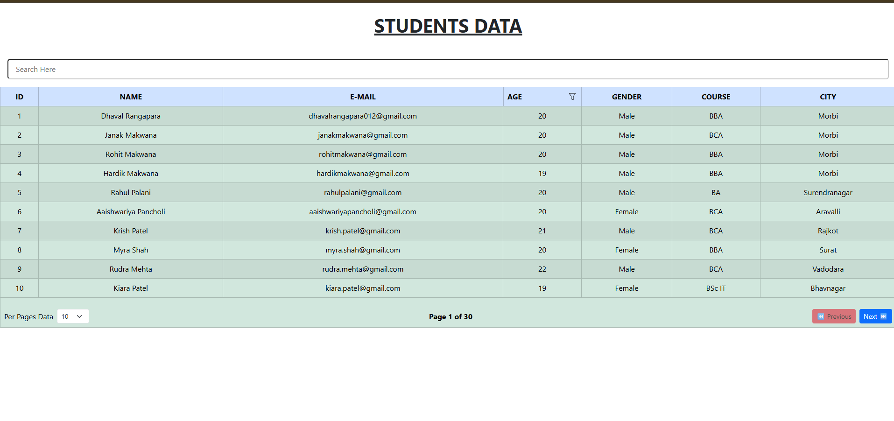
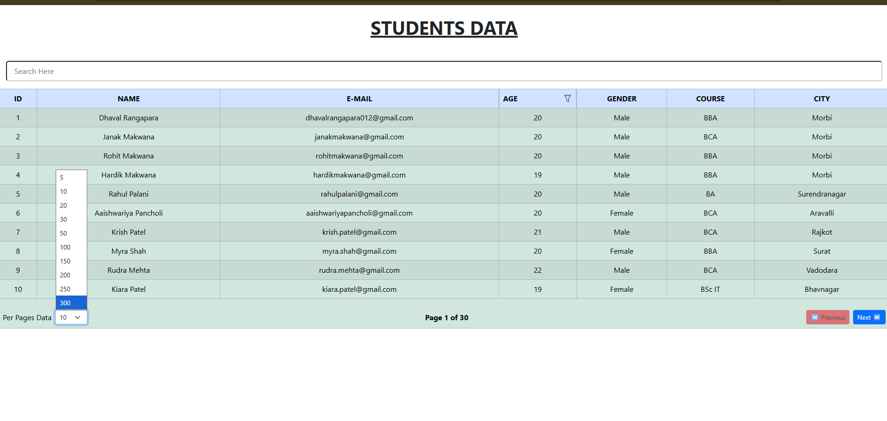

# 📝 Students Data - React Project

A simple **Students Data Management Web Application** built using **React.js** and **JSON Server**.

This project displays student information in a responsive table, including student ID, name, email, age, gender, course, and city.

The project also provides **Search, Age Sorting, Pagination, and Records Per Page** functionality using React and JSON Server REST API.

---

## 📌 Project Overview

The Students Data Management project is created using React components and JSON Server.

The project contains a main student management section where users can:

* 📋 View Students Data

* 🔍 Search Students

* 🔃 Sort Students by Age

* 📄 View Data Using Pagination

* 🔢 Select Number of Records Per Page

* ⏮️ Navigate to Previous Page

* ⏭️ Navigate to Next Page

The Students page displays student information dynamically using data fetched from JSON Server.

---

## ✨ Features

* 🎓 Display Multiple Students

* 🆔 Show Student ID

* 👤 Show Student Name

* 📧 Show Student E-Mail

* 🎂 Show Student Age

* 🚻 Show Student Gender

* 📚 Show Student Course

* 🏙️ Show Student City

* 🔍 Search Student by Name

* 🔃 Sort Students by Age

* 📄 Pagination

* 🔢 Select Records Per Page

* ⏮️ Previous Page

* ⏭️ Next Page

* 📊 Dynamic Data Rendering

* ⚛️ React Components

* 🎨 Bootstrap Styling

* 🔗 JSON Server REST API

* 📱 Responsive Table Layout

* 🔹 React Icons

---

## 🛠️ Technologies Used

* React.js

* JavaScript

* HTML5

* JSX

* Bootstrap

* React Icons

* JSON Server

* Fetch API

---

## 📊 Student Table

Each student is displayed inside a separate table row.

```text
        Student ID
             ↓
          Student Name
             ↓
          E-Mail
             ↓
            Age
             ↓
          Gender
             ↓
          Course
             ↓
            City
```

The table displays all important information about each student.

The **Search** functionality allows users to search students by name.

The **Age Filter** allows users to sort students according to their age.

---

## 🔍 Search Functionality

The project provides a search input field for searching students by name.

Example:

```text
Search Here → dhaval
```

The application displays only students whose name matches the entered search text.

The search is **case-insensitive**.


---

## 🔃 Age Sorting

The project provides a filter icon beside the **AGE** column.

When the filter button is clicked, students are sorted according to their age.


The sorting displays students from:

```text
Youngest → Oldest
```

---

## 📄 Pagination

The project includes pagination to display a limited number of students on each page.

Users can select the number of records per page:

```text
5
10
20
30
50
100
150
200
250
300
```

---

## ⚛️ React Concepts Used

This project demonstrates several important React concepts:

* Components

* `useState`

* `useEffect`

* `useMemo`

* Array `map()` Method

* Array `filter()` Method

* Array `sort()` Method

* Array `slice()` Method

* Dynamic Data Rendering

* Controlled Input

* Event Handling

* REST API Integration

* Pagination

* Search Functionality

* Component State Management

---

## 📂 Project Structure

```text
table-pagination/
│
├── node_modules/
│
├── public/
│
├── src/
│   ├── assets/
│   ├── App.css
│   ├── App.jsx
│   └── main.jsx
│
├── .gitignore
├── db.json
├── eslint.config.js
├── index.html
├── package-lock.json
├── package.json
├── README.md
└── vite.config.js
```

---


## ▶️ How to Run

### Clone the Project


git clone:- <https://github.com/Alpesh-2007/studentdata-table>


### Go to the Project Folder

```bash
cd students
```

### Install Dependencies

```bash
npm install
```

### Install JSON Server

If JSON Server is not installed:

```bash
npm install -g json-server
```

### Run JSON Server

```bash
json-server --watch db.json
```

Students API:

http://localhost:3000/students


### Run the React Project

Open another terminal and run:

```bash
npm run dev
```

Then open the localhost URL shown in the terminal.

---

## 📸 Screenshots

 screenshot here:






## 🎥 Demo Video

Project demo video link here:

[▶ Watch Demo Video](https://drive.google.com/file/d/1jfDy5y-UULL_cFVWatHfRWugp31cP0CK/view?usp=sharing)

---

## 👨‍💻 Author

**@ALPESH SARVAIYA..❤️‍🩹**
---
